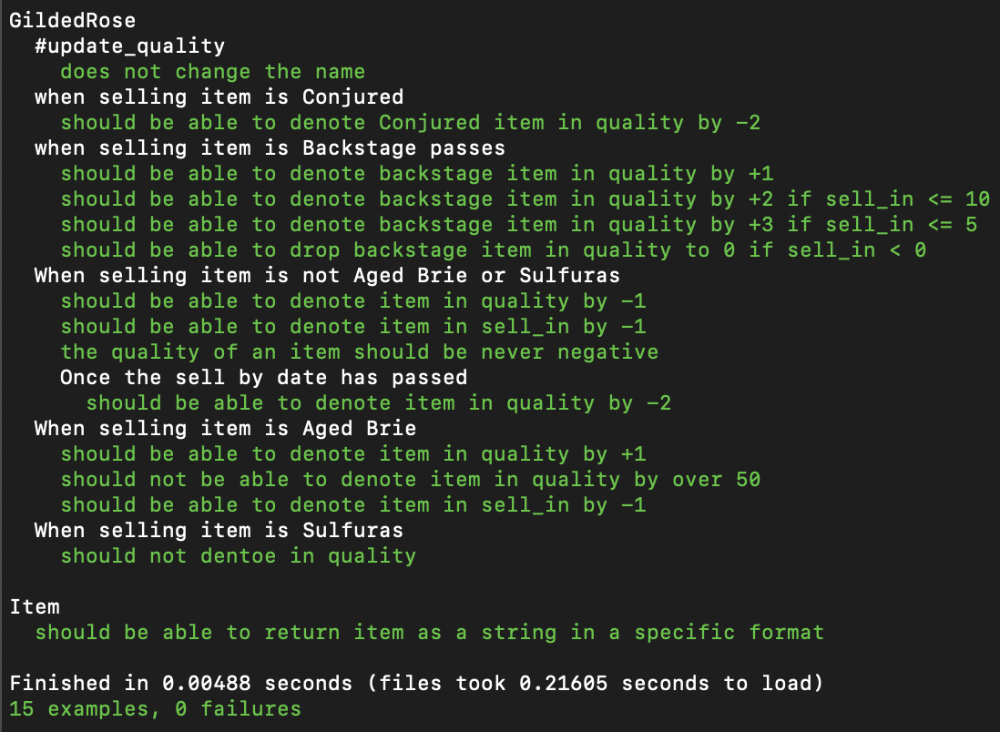

# Gilded Rose Refactoring Kata

[Project Description](#refactoring-kata-&-description) | [Installation](#getting-started) | [Running tests](#running-tests)

This Kata was originally created by Terry Hughes (http://twitter.com/TerryHughes). It is already on GitHub [here](https://github.com/NotMyself/GildedRose). See also [Bobby Johnson's description of the kata](http://iamnotmyself.com/2011/02/13/refactor-this-the-gilded-rose-kata/).

## Refactoring Kata & Description

Hi and welcome to team Gilded Rose. As you know, we are a small inn with a
prime location in a prominent city ran by a friendly innkeeper named
Allison. We also buy and sell only the finest goods. Unfortunately, our
goods are constantly degrading in quality as they approach their sell by
date. We have a system in place that updates our inventory for us. It was
developed by a no-nonsense type named Leeroy, who has moved on to new
adventures. Your task is to add the new feature to our system so that we
can begin selling a new category of items. First an introduction to our
system:

- All items have a SellIn value which denotes the number of days we have
  to sell the item
- All items have a Quality value which denotes how valuable the item is
- At the end of each day our system lowers both values for every item

Pretty simple, right? Well this is where it gets interesting:

- Once the sell by date has passed, Quality degrades twice as fast
- The Quality of an item is never negative
- "Aged Brie" actually increases in Quality the older it gets
- The Quality of an item is never more than 50
- "Sulfuras", being a legendary item, never has to be sold or decreases
  in Quality
- "Backstage passes", like aged brie, increases in Quality as it's SellIn
  value approaches; Quality increases by 2 when there are 10 days or less
  and by 3 when there are 5 days or less but Quality drops to 0 after the
  concert

We have recently signed a supplier of conjured items. This requires an
update to our system:

- "Conjured" items degrade in Quality twice as fast as normal items

Feel free to make any changes to the UpdateQuality method and add any
new code as long as everything still works correctly. However, do not
alter the Item class or Items property as those belong to the goblin
in the corner who will insta-rage and one-shot you as he doesn't
believe in shared code ownership (you can make the UpdateQuality
method and Items property static if you like, we'll cover for you).

Just for clarification, an item can never have its Quality increase
above 50, however "Sulfuras" is a legendary item and as such its
Quality is 80 and it never alters.

## Specification

## Requirements

- You should be able to interact with your code via a REPL like IRB. (You don't need to implement a command line interface that takes input from STDIN.)
- Data can be kept in memory (it doesn't need to be stored to a database or anything).
- You'll want to look at the ["Gilded Rose Requirements"](https://github.com/emilybache/GildedRose-Refactoring-Kata/tree/master/GildedRoseRequirements.txt) which explains what the code is for.

## Getting Started

- Clone this repository
  `$ git clone https://github.com/EdAncerys/GildedRose-Refactoring-Kata`
- Navigate to local repository
  `$ cd GildedRose-Refactoring-Kata`
- Install bundler if you don't already have it
  `$ gem bundle install`
- Install all dependencies
  `$ bundle install`

## Running tests

- Navigate to local repository
  `$ cd GildedRose-Refactoring-Kata`
- In the terminal type the following command:
  `$ rspec`

## RSpec and test coverage

  

## Final Product Functionality

- As a User able to run app functionality by calling #update_quality() on instance of the class.
- As a User you able to manipulate/update item quality and sell_in attributes.
- All changes stored in local storage.

### License

The project is available as open source

## Suggested attribution

[The original repository can be found folowing this link](https://github.com/NotMyself/GildedRose)
